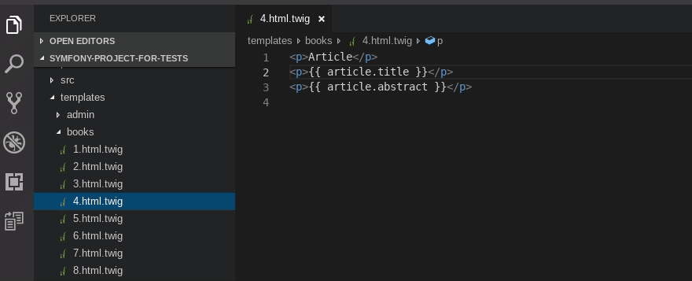
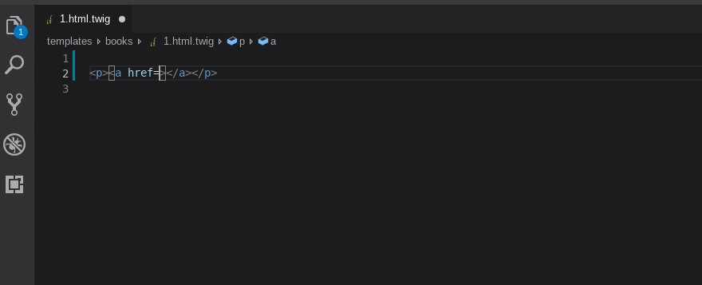
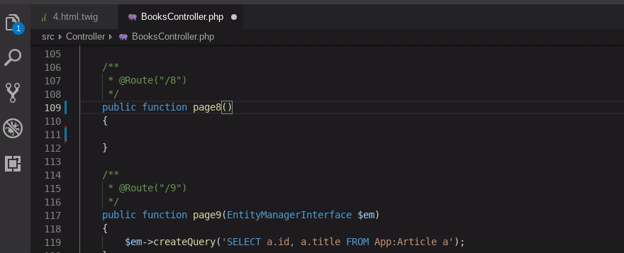

# Symfony Helper

A vscode extension (and language server) for symfony projects (starting with version 4.0 of symfony)

## Some previews

Search for references to entity field in dql and twig.

Completion of route in `href`.

Completion of autowired typehints (start typing with '.')

## Features

`Support` means some combination of completion, definition, hover, reference search and signature help.

### Twig

* Support of user-defined and vendor-defined functions, filters, tests and globals
* Support of macros
* Support of render parameters from `AbstractController#render()` and `AbstractController#renderView()`
* Support of globals defined in `twig.yaml`
* Support of properties and methods of objects
* Support of first argument of `path()` and `url()` functions
* Support of argument of `constant()` function
* Support of template names in `extends` and `include` tags
* Support of block names
* Support of variables defined in ``
* Completion for results of some raw sql queries.
* Special completion of route name in `href`
* Smarter snippets for tags
    * only shown outside of ``, `{{}}` and `{##}`
    * autoindent for `` and `` after completion
* Folding
* `Extend Template` command 
  Position and layout of used blocks are stored in `.symfony-helper.json` file and can be configured by hand.
* `Toggle Twig Comment` command 
  It uncomments comment when cursor is inside of the comment. 
  It comments selected block of text when that block is not inside comment.
* `Open Compiled Template` command 
  It opens compiled form of template from `var/cache/dev/twig/`

### DQL

* Support of entities and entity fields in dql string literals
* Definition and hover for `repositoryClass` and `targetEntity` in annotations of entity classes

### PHP
* Completion of autowired typehints (start typing with '.' because I don't want intersection with php intellisense)
* Support of `UrlGeneratorInterface#generate()` and `AbstractController#generateUrl()`
* Support of first argument of `AbstractController#render()` and `AbstractController#renderView()`
* Support of argument of `AbstractController#get()` and `AbstractController#getParameter()`

### YAML

* Definition and hover for `controller` field in routing files

### XML

In service definition files

* Definition and hover for `class` and `alias` attributes of `<service>`
* Definition and hover for `id` attribute of `<argument type="service">` in service definitions

### Containers and virtual machines (docker, vagrant, ...)

See `symfonyHelper.consoleHelper.*` settings.

Also, install `vscode-symfony-helper.php` into the `public/` folder of the project with `Install Http Helper` command.

## Configuring

1. Extension needs a globally installed php interpreter (see `symfonyHelper.phpParser.phpPath` setting)
2. For best speed, set `symfonyHelper.phpParser.phpPath` to php without `xdebug`

## Hints

* If type of a variable aren't recognized in twig, try `@var` annotation.
* Add `php` to `emmet.excludeLanguages`, because emmet gives useless suggestions in dql queries.
* This extension doesn't really make sense without a vscode extension for php. The best one is probably [PHP Intelephense](https://marketplace.visualstudio.com/items?itemName=bmewburn.vscode-intelephense-client).

## Roadmap

* Support twig and dql in arbitrary php projects (it also means older versions of symfony)
* Support dql query builder (also refactoring to dql and from dql)
* Make sure that language server is really reusable
* Rewrite php parser in ~~rust~~ typescript or rust and use as javascript/wasm module. External parser process annoys me.

## Real State of the Project

Many features are unfinished or inconsistent.

Project code needs serious refactoring.

It was tested only on symfony 4.2 on my linux machine.

It seems usable on windows.

I don't know whether it works on Mac OS.
