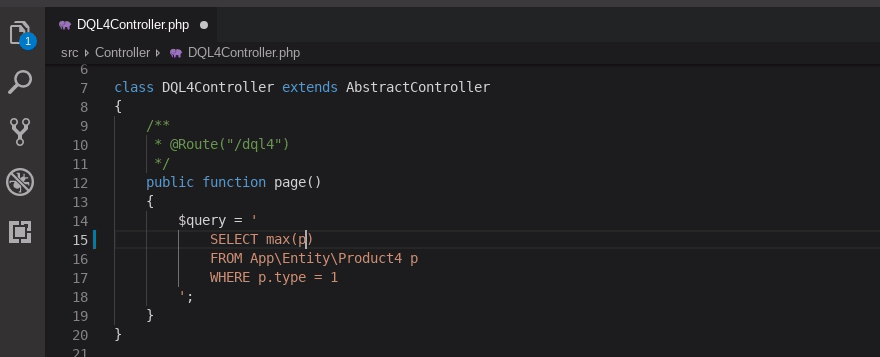

# Symfony Helper

A VSCode extension for Twig and DQL in any PHP project. Special support for Symfony projects.

New in version 1.0.7

* basic support for entities defined in xml files (only in Symfony projects; only definition, hover and completion in DQL literals)

New in version 1.0.6

* support for Symfony projects starting from version 2.8 of Symfony
* basic support for arbitrary PHP projects (see [here](https://github.com/tmrdh/symfony-helper/wiki/Arbitrary-PHP-Projects))

## Some previews

Search for references to entity field in dql and twig.

 
Completion in dql

 
Completion for route in `href`.

 
Completion for autowired typehints (start typing with '.')

## Features

`Support` means some combination of completion, definition, hover, reference search and signature help.

### Twig

* Support for user-defined and vendor-defined functions, filters, tests and globals
* Support for variables defined in `AbstractController#render()`, `` and `twig.yaml`
* Support for macros
* Support for properties and methods of objects
* Support for first argument of functions `path()`, `url()`, `constant()`
* Support for template names in `extends` and `include` tags
* Support for block names
* Special completion of route name in `href`
* Snippets for tags
    * They are active only outside of ``, `{{}}` and `{##}`
    * `` and `` are autoindented after completion
* Folding
* `Extend Template` command 
  Position and layout of used blocks are stored in `.symfony-helper.json` file and can be configured by hand.
* `Toggle Twig Comment` command 
  It uncomments comment when cursor is inside of the comment. 
  It comments selected block of text when that block is not inside comment.
* `Open Compiled Template` command 
  It opens compiled form of template from `var/cache/dev/twig/`

### Doctrine and DQL

* Support for entities and entity fields in dql string literals
* Definition and hover for `repositoryClass` and `targetEntity` in annotations of entity classes

### PHP
* Completion for autowired typehints (start typing with '.' because I don't want intersection with php intellisense)
* Support for first argument of methods `generateUrl()`, `render()`, `get()`, `getParameter()` of `AbstractController`
* Support for first argument of `UrlGeneratorInterface#generate()`

### YAML

* Definition and hover for `controller` field in routing files

### XML

In service definition files

* Definition and hover for `class` and `alias` attributes of `<service>`
* Definition and hover for `id` attribute of `<argument type="service">` in service definitions

### Containers and virtual machines (docker, vagrant, ...)

1) Install `vscode-symfony-helper.php` into the `public/` or `web/` folder of your project with `Install Http Helper` command.
2) Configure web server of container to access installed file with browser.
3) Properly set `symfonyHelper.consoleHelper.*` settings.

## Configuring

1. Extension needs a globally installed php interpreter (see `symfonyHelper.phpParser.phpPath` setting)
2. For best speed, set `symfonyHelper.phpParser.phpPath` to php without `xdebug`

## Hints

* If type of a variable aren't recognized in twig, try `@var` annotation.
* Add `php` to `emmet.excludeLanguages`, because emmet gives useless suggestions in dql queries.
* This extension doesn't really make sense without a vscode extension for php. The best one is probably [PHP Intelephense](https://marketplace.visualstudio.com/items?itemName=bmewburn.vscode-intelephense-client).

## Roadmap

* Finish support for twig and dql in arbitrary php projects
* Add support for dql query builder (definition and completion for entity fields, refactoring to dql and from dql)
* Make sure that language server is really reusable
